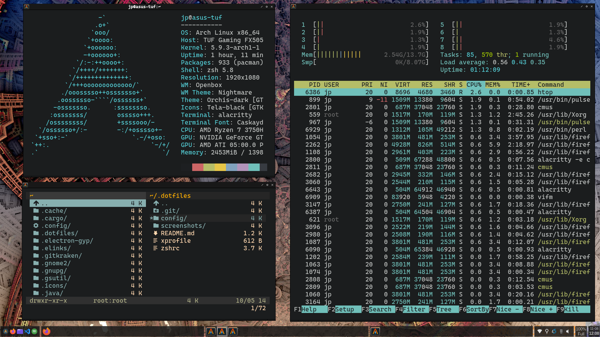

# Openbox Config

<!-- markdownlint-configure-file { "MD013": { "line_length": 500 } } -->



## Table of contents

1. [About Openbox](#about-openbox)
2. [Autostart](#autostart)
3. [Menu](#menu)
4. [Source File](#source-file)
5. [Information about my config](#information-about-my-config)

### About Openbox

Extract from the official [website] for Openbox

"Openbox is a highly configurable, next generation window manager with extensive standards support."

[website]: http://openbox.org/wiki/Main_Page

Because Openbox is only a window manager in case we want a panel, like the one shown in the image, we need to install an external application such as Tint2, Xmobar, Polybar, etc. In this case, I use [Tint2](https://gitlab.com/o9000/tint2) in my configuration.

### Autostart

The "[autostart](autostart)" file that will be executed at logon within the window manager. This file contains all the bash commands for the operating system utility daemons.

#### My autostart file

```bash
# Launch the panel
tint2 &

# Daemon for the volume icon
volumeicon &

# Daemon for the eye-care utility
redshift-gtk & disown
```

### Menu

Openbox has as a feature an integrated menu that contains shortcuts to applications of our Unix system, besides giving us the possibility of executing customized actions directly from the menu. All the menu configurations are defined in the [menu](menu.xml) file, in this case, I have used the "[menumaker]" tool for the automatic generation of this file.

[menumaker]: http://menumaker.sourceforge.net/

### Source File

All the own configurations of the Openbox window manager are defined in the [rc](rc.xml) file.

I personally consider that the official [documentation](http://openbox.org/wiki/Help:Configuration) provides a clear and detailed explanation of each of the elements contained in the configuration file, so I highly recommend reviewing this documentation to make your custom Openbox configuration.

### Information about my config

#### Workspaces

Inside Openbox the workspaces takes the name of "desktops".

```xml
<desktops>
    <number>6</number>
    <firstdesk>1</firstdesk>
    <names>
        <name>Web</name>
        <name>Dev</name>
        <name>Cfg</name>
        <name>Sys</name>
        <name>Pkg</name>
        <name>Media</name>
    </names>
    <popupTime>875</popupTime>
</desktops>
```

#### Keybindings

Declaration of my personal keybindings that I use when I'm inside Openbox, these are some important:

| Key                          | Action                                             |
| ---------------------------- | -------------------------------------------------- |
| **ModKey + Return**          | Launches the default terminal emulator of the host |
| **ModKey + (1 - 6)**         | Switch to the selected workspace                   |
| **ModKey + Shift + (1 - 6)** | Send the focused window to the selected workspace  |
| **ModKey + s**               | Minimize the focus window                          |
| **ModKey + d**               | Minimize all windows                               |
| **ModKey + w**               | Close the focus window                             |
| **Alt + (Shift +) Tab**      | Change the current focus window                    |
| **ModKey + Ctrl + r**        | Restart Openbox                                    |
| **ModKey + m**               | Launchs Rofi Drun mod                              |
| **ModKey + Shift + p**       | Launchs Cmus Music Player                          |
| **ModKey + Shift + s**       | Open tool for a selection screenshot               |
| **ModKey + Shift + f**       | Launchs Firefox                                    |

```xml
  <keyboard>
    <chainQuitKey>C-g</chainQuitKey>

    <!-- Keybindings for desktop switching -->
    <keybind key="W-1">
      <action name="GoToDesktop">
        <to>1</to>
      </action>
    </keybind>
    <keybind key="W-2">
      <action name="GoToDesktop">
        <to>2</to>
      </action>
    </keybind>
    <keybind key="W-3">
      <action name="GoToDesktop">
        <to>3</to>
      </action>
    </keybind>
    <keybind key="W-4">
      <action name="GoToDesktop">
        <to>4</to>
      </action>
    </keybind>
    <keybind key="W-5">
      <action name="GoToDesktop">
        <to>5</to>
      </action>
    </keybind>
    <keybind key="W-6">
      <action name="GoToDesktop">
        <to>6</to>
      </action>
    </keybind>

    <!-- Send Focus Window to another desktop -->
    <keybind key="W-S-1">
      <action name="SendToDesktop">
        <to>1</to>
        <wrap>no</wrap>
      </action>
    </keybind>
    <keybind key="W-S-2">
      <action name="SendToDesktop">
        <to>2</to>
        <wrap>no</wrap>
      </action>
    </keybind>
    <keybind key="W-S-3">
      <action name="SendToDesktop">
        <to>3</to>
        <wrap>no</wrap>
      </action>
    </keybind>
    <keybind key="W-S-4">
      <action name="SendToDesktop">
        <to>4</to>
        <wrap>no</wrap>
      </action>
    </keybind>
    <keybind key="W-S-5">
      <action name="SendToDesktop">
        <to>5</to>
        <wrap>no</wrap>
      </action>
    </keybind>
    <keybind key="W-S-6">
      <action name="SendToDesktop">
        <to>6</to>
        <wrap>no</wrap>
      </action>
    </keybind>

    <!-- Minimize the focus windows -->
    <keybind key="W-s">
      <action name="Iconify"/>
    </keybind>

    <!-- Minimize all active windows in workspace -->
    <keybind key="W-d">
      <action name="ToggleShowDesktop"/>
    </keybind>

    <!-- Close the focus window -->
    <keybind key="W-w">
      <action name="Close"/>
    </keybind>

    <!-- Keybindings for window switching -->
    <keybind key="A-Tab">
      <action name="NextWindow">
        <finalactions>
          <action name="Focus"/>
          <action name="Raise"/>
          <action name="Unshade"/>
        </finalactions>
      </action>
    </keybind>
    <keybind key="A-S-Tab">
      <action name="PreviousWindow">
        <finalactions>
          <action name="Focus"/>
          <action name="Raise"/>
          <action name="Unshade"/>
        </finalactions>
      </action>
    </keybind>

    <!-- ** Keybindings for window tiling ** -->
    <!-- Full Screen -->
    <keybind key="W-Up">
      <action name="Maximize"/>
      <action name="Focus"/>
      <action name="Raise"/>
    </keybind>

    <!-- MiddleScreen -->
    <keybind key="W-Down">
      <action name="UnmaximizeFull"/>
      <action name="MoveResizeTo">
        <x>center</x>
        <y>center</y>
        <height>90%</height>
        <width>80%</width>
      </action>
      <action name="Focus"/>
      <action name="Raise"/>
    </keybind>

    <!-- HalfLeftScreen -->
    <keybind key="W-Left">
      <action name="UnmaximizeFull"/>
      <action name="MoveResizeTo">
        <x>0</x>
        <y>0</y>
        <height>100%</height>
        <width>50%</width>
      </action>
      <action name="Focus"/>
      <action name="Raise"/>
    </keybind>

    <!-- HalfRightScreen -->
    <keybind key="W-Right">
      <action name="UnmaximizeFull"/>
      <action name="MoveResizeTo">
        <x>-0</x>
        <y>0</y>
        <height>100%</height>
        <width>50%</width>
      </action>
      <action name="Focus"/>
      <action name="Raise"/>
    </keybind>

    <!-- UpperQuarterLeft -->
    <keybind key="C-W-Up">
      <action name="UnmaximizeFull"/>
      <action name="MoveResizeTo">
        <x>0</x>
        <y>0</y>
        <height>50%</height>
        <width>50%</width>
      </action>
      <action name="Focus"/>
      <action name="Raise"/>
    </keybind>

    <!-- LowerQuarterLeft -->
    <keybind key="C-W-Left">
      <action name="UnmaximizeFull"/>
      <action name="MoveResizeTo">
        <x>0</x>
        <y>-0</y>
        <height>50%</height>
        <width>50%</width>
      </action>
      <action name="Focus"/>
      <action name="Raise"/>
    </keybind>

    <!-- LowerQuarterRight -->
    <keybind key="C-W-Down">
      <action name="UnmaximizeFull"/>
      <action name="MoveResizeTo">
        <x>-0</x>
        <y>-0</y>
        <height>50%</height>
        <width>50%</width>
      </action>
      <action name="Focus"/>
      <action name="Raise"/>
    </keybind>

    <!-- UpperQuarterRight -->
    <keybind key="C-W-Right">
      <action name="UnmaximizeFull"/>
      <action name="MoveResizeTo">
        <x>-0</x>
        <y>0</y>
        <height>50%</height>
        <width>50%</width>
      </action>
      <action name="Focus"/>
      <action name="Raise"/>
    </keybind>

    <!-- ** Keybindings for running applications ** -->
    <!-- Rofi -->
    <keybind key="W-m">
      <action name="Execute">
        <startupnotify>
          <enabled>true</enabled>
          <name>Rofi</name>
        </startupnotify>
        <command>rofi -show drun</command>
      </action>
    </keybind>
    <keybind key="W-S-m">
      <action name="Execute">
        <startupnotify>
          <enabled>true</enabled>
          <name>Rofi Nav</name>
        </startupnotify>
        <command>rofi -show</command>
      </action>
    </keybind>

    <!-- Terminal  -->
    <keybind key="W-Return">
      <action name="Execute">
        <startupnotify>
          <enabled>true</enabled>
          <name>Terminal</name>
        </startupnotify>
        <command>alacritty</command>
      </action>
    </keybind>

    <!-- Restart Openbox -->
    <keybind key="W-C-r">
      <action name="Execute">
        <startupnotify>
          <enabled>true</enabled>
          <name>Restart</name>
        </startupnotify>
        <command>openbox --restart</command>
      </action>
    </keybind>

    <!-- Cmus -->
    <keybind key="W-S-p">
      <action name="Execute">
        <startupnotify>
          <enabled>true</enabled>
          <name>Cmus</name>
        </startupnotify>
        <command>alacritty -e cmus</command>
      </action>
    </keybind>

    <!-- Shutter -->
    <keybind key="W-S-s">
      <action name="Execute">
        <startupnotify>
          <enabled>true</enabled>
          <name>Shutter</name>
        </startupnotify>
        <command>shutter -s</command>
      </action>
    </keybind>

    <!-- Firefox -->
    <keybind key="W-S-f">
      <action name="Execute">
        <startupnotify>
          <enabled>true</enabled>
          <name>Firefox</name>
        </startupnotify>
        <command>firefox</command>
      </action>
    </keybind>

    <!-- ** Hardware ** -->
    <!-- Volume -->
    <keybind key="XF86AudioLowerVolume">
      <action name="Execute">
        <startupnotify>
          <enabled>true</enabled>
          <name>Vol Low</name>
        </startupnotify>
        <command>pamixer --decrease 3</command>
      </action>
    </keybind>
    <keybind key="XF86AudioRaiseVolume">
      <action name="Execute">
        <startupnotify>
          <enabled>true</enabled>
          <name>Vol Up</name>
        </startupnotify>
        <command>pamixer --increase 3</command>
      </action>
    </keybind>
    <keybind key="XF86AudioMute">
      <action name="Execute">
        <startupnotify>
          <enabled>true</enabled>
          <name>Vol Mute</name>
        </startupnotify>
        <command>pamixer --toggle-mute</command>
      </action>
    </keybind>

    <!-- Brightness -->
    <keybind key="XF86MonBrightnessUp">
      <action name="Execute">
        <startupnotify>
          <enabled>true</enabled>
          <name>Bright Up</name>
        </startupnotify>
        <command>brightnessctl set +1%</command>
      </action>
    </keybind>
    <keybind key="XF86MonBrightnessDown">
      <action name="Execute">
        <startupnotify>
          <enabled>true</enabled>
          <name>Bright Down</name>
        </startupnotify>
        <command>brightnessctl set 1%-</command>
      </action>
    </keybind>
  </keyboard>
```
