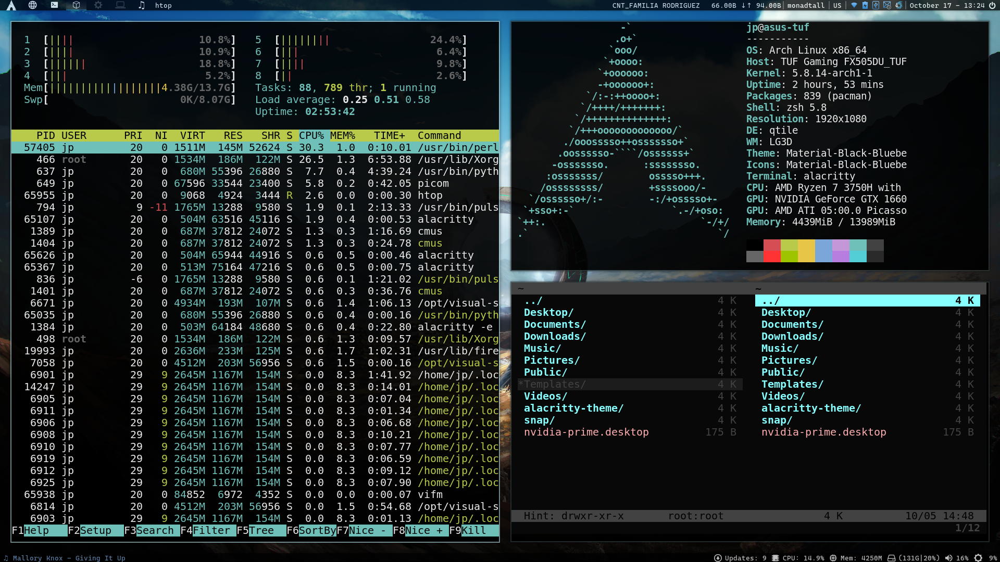

# Qtile Config



## Table of contents

1. [About Qtile](#about-qtile)
2. [Imports](#imports)
3. [Variables](#variables)
4. [Autostart](#autostart)
5. [Custom hooks](#custom-hooks)
6. [Keys](#keys)
7. [Workspaces](#workspaces)
8. [Layouts](#layouts)
9. [Widgets](#widgets)
10. [Screens](#screens)
11. [Mouse](#mouse)
12. [Inner Settings](#inner-settings-qtile)

### About Qtile

Extract from the official **[website]** for Qtile

"A full-featured, hackable tiling window manager written and configured in Python"

[website]: http://www.qtile.org/

### Imports

Python modules that must be imported in this configuration file.

```python
import subprocess

from os import path
from libqtile import hook

from typing import List

from libqtile import bar, layout, widget
from libqtile.config import Click, Drag, Group, Key, Screen
from libqtile.lazy import lazy
from libqtile.utils import guess_terminal
```

### Variables

Declaration of the variables that I used for the rest of the configuration.

```python
mod = "mod4"
terminal = guess_terminal()
br_path = '/sys/class/backlight/amdgpu_bl0/brightness'
br_max_path = '/sys/class/backlight/amdgpu_bl0/max_brightness'
hard_color = 'E88360'
soft_color = '3C578C'
```

### Autostart

Declaration of the function used to read and execute the autostart file at the beginning of the Qtile session.

```python
qtile_path = path.join(path.expanduser('~'), ".config", "qtile")

@hook.subscribe.startup_once
def autostart():
    subprocess.call([path.join(qtile_path, 'autostart.sh')])
```

#### Autostart file

```bash
# Daemon for the battery icon
cbatticon -u 5 &

# Daemon for the eye-care utility
redshift-gtk & disown
```

### Custom hooks

Declaration of custom functions to be executed when an event happen inside Qtile.

```python
# Launch every dialog window as a floating window

@hook.subscribe.client_new
def floating_dialogs(window):
    dialog = window.window.get_wm_type() == 'dialog'
    transient = window.window.get_wm_transient_for()
    if dialog or transient:
        window.floating = True
```

### Keys

Declaration of my personal keybindings that I use when I'm inside a Qtile session, these are some important:

| Key                    | Action                                                      |
| ---------------------- | ----------------------------------------------------------- |
| **ModKey + Return**    | Launchs the terminal defined in the guess_terminal variable |
| **ModKey + Tab**       | Change the current layout                                   |
| **ModKey + w**         | Close the focus window                                      |
| **ModKey + Ctrl + r**  | Restart Qtile                                               |
| **ModKey + Ctrl + q**  | Close Qtile session                                         |
| **ModKey + m**         | Launchs Rofi Drun mod                                       |
| **ModKey + Shift + p** | Launchs Cmus Music Player                                   |
| **ModKey + Shift + s** | Launchs Shutter                                             |
| **ModKey + Shift + f** | Launchs Firefox                                             |

```python
keys = [

    # Switch focus between windows in current stack pane
    Key([mod], "k", lazy.layout.down(),
        desc="Move focus down in stack pane"),
    Key([mod], "j", lazy.layout.up(),
        desc="Move focus up in stack pane"),
    Key([mod], "h", lazy.layout.left(),
        desc="Move focus left in stack pane"),
    Key([mod], "l", lazy.layout.right(),
        desc="Move focus right in stack pane"),

    # Change window sizes (MonadTall)
    Key([mod, "shift"], "l", lazy.layout.grow(),
        lazy.layout.increase_nmaster(),
        desc="Grow size of master window"),
    Key([mod, "shift"], "h", lazy.layout.shrink(),
        lazy.layout.decrease_nmaster(),
        desc="Shrink size of master window"),

    # Move windows in current stack
    Key([mod, "control"], "k", lazy.layout.shuffle_down(),
        desc="Move window down in current stack "),
    Key([mod, "control"], "j", lazy.layout.shuffle_up(),
        desc="Move window up in current stack "),
    Key([mod, "control"], "h", lazy.layout.shuffle_left(),
        desc="Move window right in current stack "),
    Key([mod, "control"], "l", lazy.layout.shuffle_right(),
        desc="Move window left in current stack "),

    # Actions for the monitors
    Key([mod], "a", lazy.to_screen(0),
        desc="Move focus to monitor 1"),
    Key([mod], "s", lazy.to_screen(1),
        desc="Move focus to monitor 2"),

    # Swap panes of split stack
    Key([mod, "shift"], "space", lazy.layout.rotate(),
        desc="Swap panes of split stack"),

    # Multiple stack panes
    Key([mod, "shift"], "Return", lazy.layout.toggle_split(),
        desc="Toggle between split and unsplit sides of stack"),

    # Launch guess terminal
    Key([mod], "Return", lazy.spawn(terminal),
        desc="Launch terminal"),

    # Toggle between different layouts as defined below
    Key([mod], "Tab", lazy.next_layout(),
        desc="Toggle between layouts"),

    # Direct actions from Qtile
    Key([mod], "w", lazy.window.kill(),
        desc="Kill focused window"),
    Key([mod, "control"], "r", lazy.restart(),
        desc="Restart qtile"),
    Key([mod, "control"], "q", lazy.shutdown(),
        desc="Shutdown qtile"),
    # Key([mod], "r", lazy.spawncmd(),
    #     desc="Spawn a command using a prompt widget"),

    # Keybindings for Rofi
    Key([mod], "m", lazy.spawn("rofi -show drun"),
        desc="Launch Rofi Run List"),
    Key([mod, 'shift'], "m", lazy.spawn("rofi -show"),
        desc="Launch Rofi list for the open windows"),

    # Volume
    Key([], "XF86AudioLowerVolume", lazy.spawn("pamixer --decrease 3"),
        desc="Decrease volume of default source"),
    Key([], "XF86AudioRaiseVolume", lazy.spawn("pamixer --increase 3"),
        desc="Increase volume of default source"),
    Key([], "XF86AudioMute", lazy.spawn("pamixer --toggle-mute"),
        desc="Mute volume of default source"),

    # Brightness
    Key([], "XF86MonBrightnessUp", lazy.spawn("brightnessctl set +1%"),
        desc="Increase brightness of the screen"),
    Key([], "XF86MonBrightnessDown", lazy.spawn("brightnessctl set 1%-"),
        desc="Decrease brightness of the screen"),

    # CMus Player (Music Player)
    Key([mod, "shift"], "p", lazy.spawn(terminal + " -e cmus"),
        desc="Launch Cmus Player"),
    Key([mod], "Down", lazy.spawn("cmus-remote -u"),
        desc="Play-pause-command"),
    Key([mod], "Right", lazy.spawn("cmus-remote -n"),
        desc="Next-command"),
    Key([mod], "Left", lazy.spawn("cmus-remote -r"),
        desc="Prev-command"),

    # Shutter (Screenshots)
    Key([mod, "shift"], "s", lazy.spawn("shutter"),
        desc="Launch Shutter App for Screenshots"),

    # Launch Firefox
    Key([mod, "shift"], "f", lazy.spawn("firefox"),
        desc="Launch Firefox Browser"),
]
```

### Workspaces

Declaration of my personal workspaces with its initial layout, plus the declaration of the keybindings to change between workspaces and send a focused window to another workspace.

To load the icons you need to install a [NerdFont].

[nerdfont]: https://www.nerdfonts.com/

| Key                          | Action                                            |
| ---------------------------- | ------------------------------------------------- |
| **ModKey + (1 - 6)**         | Switch to the selected workspace                  |
| **ModKey + Shift + (1 - 6)** | Send the focused window to the selected workspace |

```python
group_names = [
    ("爵", {'layout': 'max'}),
    ("", {'layout': 'monadtall'}),
    ("", {'layout': 'floating'}),
    ("", {'layout': 'floating'}),
    ("", {'layout': 'monadtall'}),
    ("♫", {'layout': 'monadtall'})
]

groups = [Group(name, **kwargs) for name, kwargs in group_names]

for i, (name, kwargs) in enumerate(group_names, 1):
    # Switch to another workspace
    keys.append(Key([mod], str(i), lazy.group[name].toscreen()))

    # Send focus window to another workspace
    keys.append(Key([mod, "shift"], str(
        i), lazy.window.togroup(name, switch_group=True)))
```

### Layouts

Declaration of the layouts that I use with its settings. There are a lot of different layouts that you could check on the Qtile documentation in their website.

```python
layout_theme = {
    "border_width": 2,
    "margin": 5,
    "border_focus": hard_color,
    "border_normal": soft_color
}

layouts = [
    layout.Max(**layout_theme),
    layout.MonadTall(**layout_theme),
    layout.Floating(**layout_theme),
]

floating_layout = layout.Floating(
    float_rules=[
        {'wmclass': 'confirm'},
        {'wmclass': 'dialog'},
        {'wmclass': 'download'},
        {'wmclass': 'error'},
        {'wmclass': 'file_progress'},
        {'wmclass': 'notification'},
        {'wmclass': 'splash'},
        {'wmclass': 'toolbar'},
        {'wmclass': 'confirmreset'},
        {'wmclass': 'makebranch'},
        {'wmclass': 'maketag'},
        {'wname': 'branchdialog'},
        {'wname': 'pinentry'},
        {'wmclass': 'ssh-askpass'},
    ]
)
```

### Widgets

The widgets are the functionalities built-in the bar from the top and the bottom of my configuration.

```python
widget_defaults = dict(
    font='Caskaydia Cove Nerd Font',
    fontsize=13,
    padding=5,
)
extension_defaults = widget_defaults.copy()

def wid_groups(): return widget.GroupBox(
    font='HeavyData Nerd Font',
    fontsize=19,
    margin=3,
    padding=8,
    borderwidth=2,
    rounded=False,
    highlight_method='line',
    disable_drag=True,
    this_current_screen_border=hard_color,
    this_screen_border=hard_color,
    other_current_screen_border=soft_color,
    other_screen_border=soft_color
)

def wid_top_main_screen(): return [
    widget.TextBox(
        text='',
        fontsize=25,
        padding=10,
        mouse_callbacks={
            'Button1': lambda qtile:
            qtile.cmd_spawn("rofi -show run")
        }
    ),
    widget.Sep(
        linewidth=0,
        padding=5
    ),
    wid_groups(),
    widget.WindowName(),
    widget.Wlan(
        interface="wlp4s0",
        format='{essid}'
    ),
    widget.Net(
        interface="wlp4s0",
        format='{down} ↓↑ {up}',
        padding=1
    ),
    widget.Sep(padding=5),
    widget.CurrentLayout(),
    widget.Sep(padding=5),
    widget.KeyboardLayout(
        configured_keyboards=['us', 'latam'],
        option='grp:win_space_toggle'
    ),
    widget.Sep(padding=5),
    widget.Systray(),
    widget.Sep(padding=5),
    widget.Clock(
        format='%B %d - %H:%M',
        mouse_callbacks={'Button1': lambda qtile: qtile.cmd_spawn(
            terminal + " -e khal interactive")}
    ),
    widget.TextBox(
        text=' ',
        fontsize=15,
        padding=3,
        mouse_callbacks={'Button1': lambda qtile: qtile.cmd_spawn(
            terminal + " -e shutdown now")}
    ),
]

def wid_bottom_main_screen(): return [
    widget.Cmus(
        play_color=hard_color,
        noplay_color=soft_color
    ),
    widget.Sep(
        linewidth=0
    ),
    widget.Spacer(),
    widget.TextBox(
        text="",
        fontsize=18
    ),
    widget.CheckUpdates(
        update_interval=3600,
        distro='Arch',
        display_format='Updates: {updates}',
        custom_command='checkupdates',
        no_update_string='N/A'
    ),
    widget.TextBox(
        text='﬙',
        fontsize=18
    ),
    widget.CPU(
        format='CPU: {load_percent}%'
    ),
    widget.TextBox(
        text='',
        fontsize=18,
        mouse_callbacks={
            'Button1': lambda qtile: qtile.cmd_spawn(
                terminal + " -e htop")}
    ),
    widget.Memory(
        format='Mem: {MemUsed}M'
    ),
    widget.TextBox(
        text='',
        fontsize=18,
        mouse_callbacks={
            'Button1': lambda qtile: qtile.cmd_spawn('Thunar')}
    ),
    widget.DF(
        format='({uf}{m}|{r:.0f}%)',
        visible_on_warn=False
    ),
    widget.TextBox(
        text='墳',
        fontsize=18,
        mouse_callbacks={
            'Button1': lambda qtile:
            qtile.cmd_spawn('pavucontrol')}
    ),
    widget.PulseVolume(),
    widget.TextBox(
        text='',
        fontsize=18
    ),
    widget.Backlight(
        brightness_file=br_path,
        max_brightness_file=br_max_path,
        change_command='brightnessctl set {0}',
        step=5
    ),
]

def wid_second_screen(): return [
    wid_groups(),
    widget.WindowName(),
    widget.Sep(padding=5),
    widget.CurrentLayout(),
    widget.Sep(padding=5),
    widget.KeyboardLayout(
        configured_keyboards=['us', 'latam'],
        option='grp:win_space_toggle'
    ),
    widget.Sep(padding=5),
    widget.TextBox(
        text='﬙',
        fontsize=18
    ),
    widget.CPU(
        format='CPU: {load_percent}%'
    ),
    widget.TextBox(
        text='',
        fontsize=18,
        mouse_callbacks={
            'Button1': lambda qtile:
            qtile.cmd_spawn(terminal + " -e htop")}
    ),
    widget.Memory(
        format='Mem: {MemUsed}M'
    ),
    widget.TextBox(
        text='墳',
        fontsize=18,
        mouse_callbacks={
            'Button1': lambda qtile:
            qtile.cmd_spawn('pavucontrol')}
    ),
    widget.PulseVolume(),
    widget.TextBox(
        text='',
        fontsize=18
    ),
    widget.Backlight(
        brightness_file=br_path,
        max_brightness_file=br_max_path,
        change_command='brightnessctl set {0}',
        step=5
    ),
]
```

### Screens

Screen settings for my double monitor setup.

```python
screens = [
    Screen(
        top=bar.Bar(wid_top_main_screen(), opacity=0.75, size=20),
        bottom=bar.Bar(wid_bottom_main_screen(), opacity=0.75, size=17)
    ),
    Screen(
        top=bar.Bar(wid_second_screen(), opacity=0.75, size=20),
    ),
]
```

### Mouse

Declaration and configuration for the mouse events inside Qtile.

| Key                              | Action                                                       |
| -------------------------------- | ------------------------------------------------------------ |
| **ModKey + Mouse Left Button**   | Changes the focused window to a floating window and drags it |
| **ModKey + Mouse Right Button**  | Changes the size of the floating focused window              |
| **ModKey + Mouse Middle Button** | Brings to the front the floating focused window              |

```python
mouse = [
    Drag([mod], "Button1", lazy.window.set_position_floating(),
         start=lazy.window.get_position()),
    Drag([mod], "Button3", lazy.window.set_size_floating(),
         start=lazy.window.get_size()),
    Click([mod], "Button2", lazy.window.bring_to_front())
]
```

### Inner settings Qtile

These are some inner settings of Qtile, if you want to change these you better read the documentation in the Qtile website before breaks it :).

```python
dgroups_key_binder = None
dgroups_app_rules = []  # type: List
main = None  # WARNING: this is deprecated and will be removed soon
follow_mouse_focus = True
bring_front_click = False
cursor_warp = False

auto_fullscreen = True
focus_on_window_activation = "urgent"

wmname = "LG3D"
```
